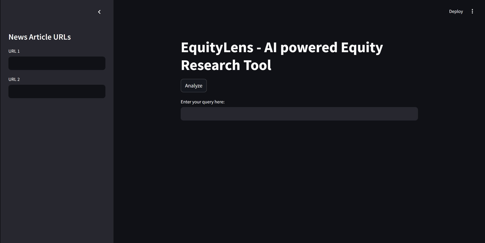
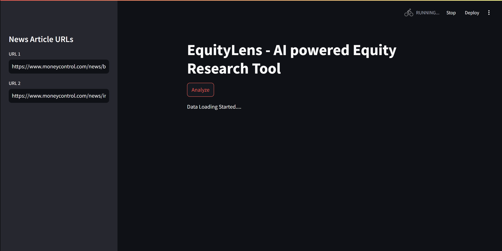
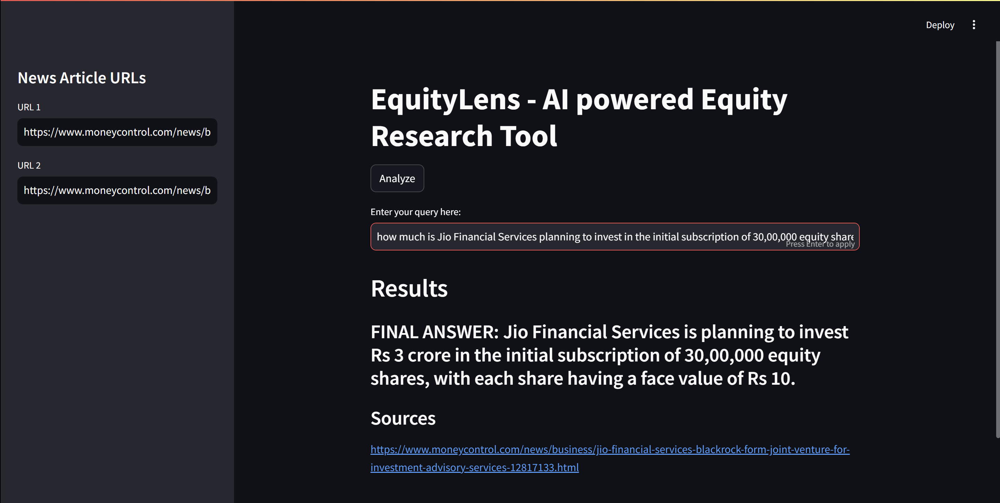

# EquityLens - AI Powered Equity Research Tool

EquityLens is an AI-powered tool designed to assist in equity research by analyzing news articles and providing insightful answers to user queries. The tool leverages advanced language models and vector databases to deliver accurate and relevant information.

## Table of Contents

- [Overview](#overview)
- [Features](#features)
- [Setup Instructions](#setup-instructions)
- [Usage](#usage)
- [Screenshots](#screenshots)
- [Requirements](#requirements)
- [Contributing](#contributing)

## Overview

EquityLens uses Streamlit for the user interface, FAISS for vector storage, and Google's Generative AI for embeddings and language models. The tool processes URLs of news articles, splits the text into manageable chunks, generates embeddings, and stores them in a FAISS index. Users can then query the tool to retrieve relevant information from the indexed articles.

## Features

- Load and analyze news articles from URLs
- Split text into chunks for efficient processing
- Generate embeddings using Google's Generative AI
- Store and retrieve embeddings using FAISS
- Interactive user interface with Streamlit

## Setup Instructions

1. **Clone the repository**:
    ```sh
    git clone https://github.com/shivaaganesh3/EquityLens.git
    cd EquityLens
    ```

2. **Create and activate a virtual environment**:
    ```sh
    python -m venv venv
    source venv/bin/activate  # On Windows use `venv\Scripts\activate`
    ```

3. **Install the required packages**:
    ```sh
    pip install -r requirements.txt
    ```

4. **Set up environment variables**:
    - Create a [`.env`] file in the root directory and add your Google API key:
        ```
        google_api_key='YOUR_GOOGLE_API_KEY'
        ```

## Usage

1. **Run the Streamlit application**:
    ```sh
    streamlit run main.py
    ```

2. **Interact with the application**:
    - Enter the URLs of news articles in the sidebar.
    - Click the "Analyze" button to process the articles.
    - Enter your query in the text input box to retrieve relevant information.

## Screenshots

### Architecture Diagram

### Main Interface


### Analysis in Progress


### Query Results


## Requirements

- Python 3.7 or higher
- See [`requirements.txt`] for a full list of dependencies

## Contributing

Contributions are welcome! Please fork the repository and submit a pull request.

